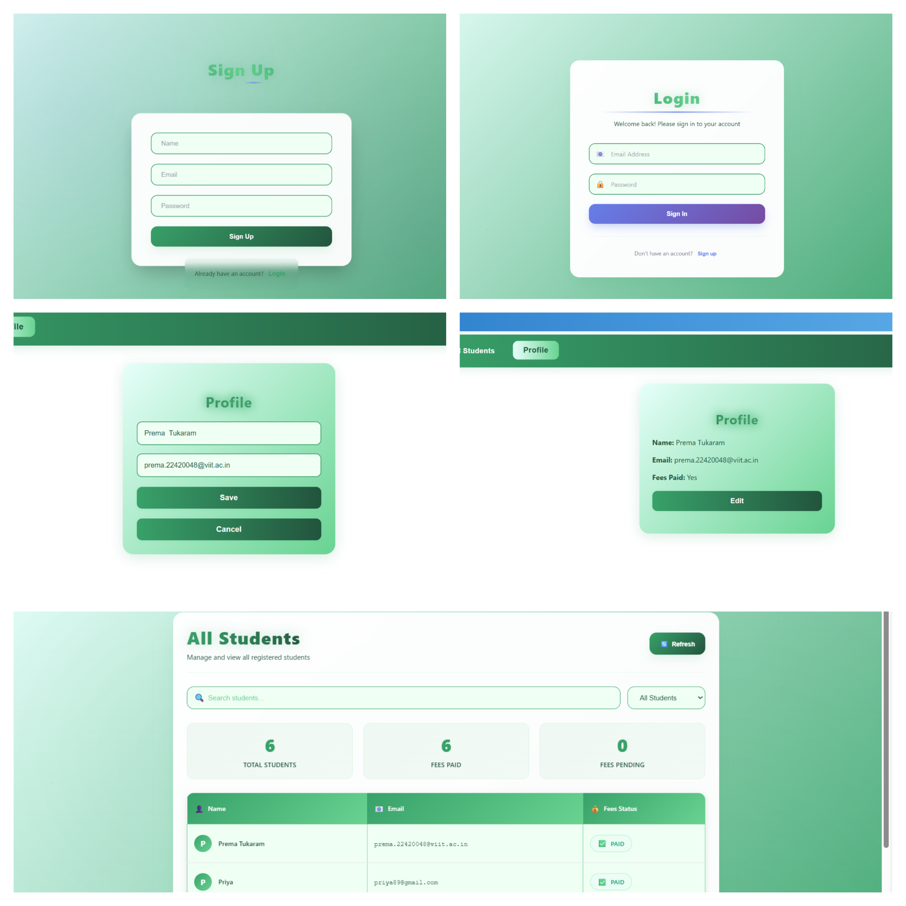

# Student Fees Management System


## 🚀 Overview
A modern, full-stack web application to manage student fees, built with React, Express, MongoDB, and Socket.io. Supports real-time updates, authentication, and a beautiful, responsive UI.

---

## ✨ Features
- **User Authentication:** Secure signup and login
- **Student Management:** View all students, update profiles
- **Fees Payment:** Mark fees as paid, real-time updates
- **Responsive UI:** Works on desktop and mobile
- **Real-time Notifications:** Socket.io integration
- **Protected Routes:** Only authenticated users can access sensitive data


## 🛠️ Tech Stack
- **Frontend:** React 19, Tailwind CSS, Socket.io-client
- **Backend:** Node.js 20, Express 4, MongoDB (Mongoose), Socket.io
- **Authentication:** JWT
- **Deployment:** Render.com

---

## 📦 Project Structure
```
Student Fees Management/
  backend/
    server.js
    routes/
    models/
    middleware/
    package.json
  frontend/
    src/
    public/
    package.json
```


## ⚙️ Setup Instructions

### 1. Clone the Repository
```sh
git clone https://github.com/PremaDongare/FeesManagementSystem.git
cd FeesManagementSystem


### 2. Backend Setup
```sh
cd backend
# Create .env file with your MongoDB URI and JWT secret
# Example .env:
# MONGO_URI=your_mongodb_connection_string
npm install
npm start
```

### 3. Frontend Setup
```sh
cd ../frontend
# Create .env file with your backend API URL
# Example .env:
# REACT_APP_API_URL=https://your-backend-url.onrender.com/api
npm install
npm start
```

---

## 🖼️ Screenshots



---

## 🤝 Contributing
Pull requests are welcome! For major changes, please open an issue first to discuss what you would like to change.

---

## 📄 License
[MIT](LICENSE)

---

##  Acknowledgements
- [React](https://reactjs.org/)
- [Express](https://expressjs.com/)
- [MongoDB](https://www.mongodb.com/)
- [Socket.io](https://socket.io/)
- [Render](https://render.com/) 
